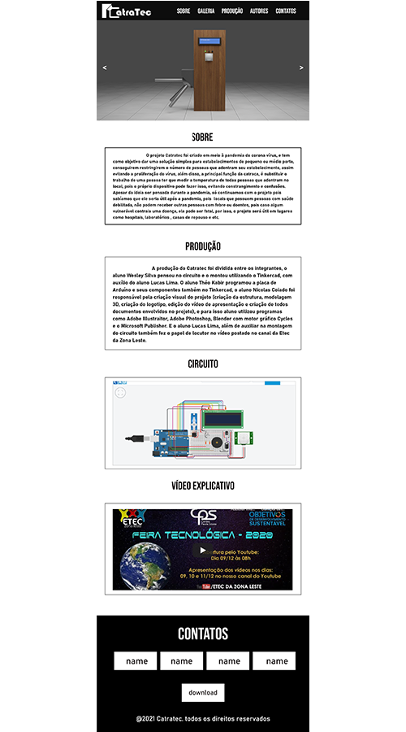

# Catratec
Esse repositório contém um projeto chamado Catratec, o site foi criado com o intuito de divulgar a Catraca eletrônica, que criei para a feira tecnológica da Etec da Zona Leste, no ano de 2020.
 
---

# Framework Bootstrap
O Framework utilizado para auxiliar na construção do site foi o Bootstrap V5.0, e está disponível [aqui](https://getbootstrap.com).

---

# O Design
O design do wireframe foi feito utilizando-se do Adobe XD.

---

# O Circuto
O circuito criado para a construção do Catratec está disponível no site chamado Tinkercad, e caso queira ter acesso a ele, basta clicar [aqui](https://www.tinkercad.com/things/kRoyELoSiHs).

---
# Behance e 3D
Caso queira ter acesso a mais coisas sobre o modelo 3D, ele está disponível no site de portifólios chamado Behance, e [clique](https://www.behance.net/gallery/108614089/Catratec) aqui para saber mais.

